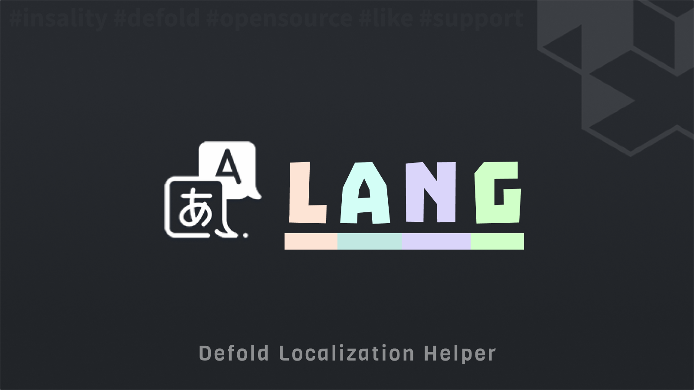

[](https://github.com/Insality/defold-lang/tags)
[](https://github.com/Insality/defold-lang/actions)
[](https://codecov.io/gh/Insality/defold-lang)

[](https://github.com/sponsors/insality) [](https://ko-fi.com/insality) [](https://www.buymeacoffee.com/insality)


# Defold Lang

**Defold Lang** is a simple localization module for **Defold**. It loads language files and manages translations in your project.

## Features

- **Handy API** - Simple and easy to use API
- **Multiple File Formats** - Support for JSON, Lua, and CSV language files
- **Saver Support** - Save current selected language in [Defold-Saver](https://github.com/Insality/defold-saver)
- **Druid Support** - Easy [Druid](https://github.com/Insality/druid) integration

## Setup

### [Dependency](https://www.defold.com/manuals/libraries/)

Open your `game.project` file and add the following line to the dependencies field under the project section:

**[Lang](https://github.com/Insality/defold-lang/archive/refs/tags/4.zip)**

```
https://github.com/Insality/defold-lang/archive/refs/tags/4.zip
```

After that, select `Project ▸ Fetch Libraries` to update [library dependencies]((https://defold.com/manuals/libraries/#setting-up-library-dependencies)). This happens automatically whenever you open a project so you will only need to do this if the dependencies change without re-opening the project.

### Library Size

> **Note:** The library size is calculated based on the build report per platform

| Platform         | Library Size |
| ---------------- | ------------ |
| HTML5            | **7.87 KB**  |
| Desktop / Mobile | **12.68 KB**  |


### Initialization

Initialize the **Lang** module by calling `lang.init()` with your language configuration:

```lua
local lang = require("lang.lang")

-- Initialize with language files
lang.init({
	{ id = "en", path = "/resources/lang/en.json" },
	{ id = "ru", path = "/resources/lang/ru.json" },
	{ id = "es", path = "/resources/lang/es.json" },
})
```

You can also force a specific language on initialization:

```lua
-- Force a specific language on start
lang.init({
	{ id = "en", path = "/resources/lang/en.json" },
	{ id = "ru", path = "/resources/lang/ru.json" },
	{ id = "es", path = "/resources/lang/es.json" },
}, "es") -- Force Spanish language
```


### Default Language

**Defold Lang** selects the language to use in the following priority order:

1. **Force parameter** - If provided as second parameter to `lang.init()`
2. **Saved language** - From `lang.state.lang` (restored from save system or manually set)
3. **System language** - Device language from `sys.get_sys_info().language`
4. **Default language** - First language in the configuration array

The first language in the configuration array serves as the ultimate fallback. Defold uses the two-character [ISO-639 format](https://en.wikipedia.org/wiki/List_of_ISO_639_language_codes) for language codes ("en", "ru", "es", etc).

The module uses `sys.load_resource` to load the files. Place your files inside your [custom resources folder](https://defold.com/manuals/project-settings/#custom-resources) to ensure they are included in the build.


### Localization Files

**Defold Lang** supports three file formats: **JSON**, **Lua**, and **CSV**. Each format has its own advantages:

#### JSON Files
JSON files use a simple key-value structure:

```json
{
	"ui_hello_world": "Hello, World!",
	"ui_hello_name": "Hello, %s!",
	"ui_settings": "Settings",
	"ui_exit": "Exit"
}
```

Initialize with JSON files:
```lua
lang.init({
	{ id = "en", path = "/locales/en.json" },
	{ id = "ru", path = "/locales/ru.json" },
	{ id = "es", path = "/locales/es.json" },
})
```

#### Lua Files
Lua files return a table with translations:

```lua
-- en.lua
return {
	ui_hello_world = "Hello, World!",
	ui_hello_name = "Hello, %s!",
	ui_settings = "Settings",
	ui_exit = "Exit"
}
```

Initialize with Lua files:
```lua
lang.init({
	{ id = "en", path = require("locales.en") },
	{ id = "ru", path = require("locales.ru") },
	{ id = "es", path = require("locales.es") },
})
```

#### CSV Files
CSV files allow multiple languages in a single file. The first column contains keys, and subsequent columns contain translations:

```csv
key,en,ru,es
ui_hello_world,"Hello, World!","Привет, мир!","¡Hola, mundo!"
ui_hello_name,"Hello, %s!","Привет, %s!","¡Hola, %s!"
ui_settings,Settings,Настройки,Configuración
ui_exit,Exit,Выход,Salir
```

Initialize with CSV files (specify column names as language IDs):
```lua
lang.init({
	{ id = "en", path = "/locales/translations.csv" },
	{ id = "ru", path = "/locales/translations.csv" },
	{ id = "es", path = "/locales/translations.csv" },
})
```

#### Mixed Format Example
You can even mix different file formats:

```lua
lang.init({
	{ id = "en", path = "/resources/lang/en.json" },
	{ id = "ru", path = "/resources/lang/ru.lua" },
	{ id = "es", path = "/resources/lang/translations.csv" },
})
```


## API Reference

### Quick API Reference

```lua
lang.init(available_langs, [lang_on_start])
lang.set_lang(lang_id)
lang.get_lang()
lang.get_langs()
lang.set_next_lang()
lang.get_next_lang()
lang.txt(text_id)
lang.txp(text_id, ...)
lang.txr(text_id)
lang.is_exist(text_id)
lang.set_logger([logger])
lang.reset_state()
```

#### Basic Usage Example

```lua
local lang = require("lang.lang")

-- Initialize with language files
lang.init({
	{ id = "en", path = "/resources/lang/en.json" },
	{ id = "ru", path = "/resources/lang/ru.json" },
	{ id = "es", path = "/resources/lang/es.json" },
})

-- Use translations
print(lang.txt("ui_hello_world"))     -- "Hello, World!"
print(lang.txp("ui_hello_name", "John")) -- "Hello, John!"

-- Change language
lang.set_lang("es")
print(lang.txt("ui_hello_world"))     -- "¡Hola, mundo!"
```

### API Reference

Read the [API Reference](API_REFERENCE.md) file to see the full API documentation for the module.


## Use Cases

Read the [Use Cases](USE_CASES.md) file to see several examples of how to use the this module in your Defold game development projects.


## FAQ

Read the [FAQ](FAQ.md) file to see the answers to frequently asked questions about the module.


## License

This project is licensed under the MIT License - see the [LICENSE](LICENSE) file for details.


## Issues and Suggestions

For any issues, questions, or suggestions, please [create an issue](https://github.com/Insality/defold-lang/issues).


## 👏 Contributors

<a href="https://github.com/Insality/defold-lang/graphs/contributors">
  
</a>

## Changelog

<details>

### **V1**
	- Initial release

### **V2**
	- Add Defold Editor Script to collect unique characters from selected JSON files

### **V3**
	- Add `lang.get_next_lang()` function
	- Better error messages

### **V4**
	- [Breaking] Lang now use `lang.init()` function to initialize module instead of `game.project` configuration
	- Add Lua file support
	- Add CSV file support
	- Updated editor script to collect unique characters from selected JSON and CSV files
	- Add Lang debug properties page for Druid properties panel

</details>


## ❤️ Support project ❤️

Your donation helps me stay engaged in creating valuable projects for **Defold**. If you appreciate what I'm doing, please consider supporting me!

[](https://github.com/sponsors/insality) [](https://ko-fi.com/insality) [](https://www.buymeacoffee.com/insality)
